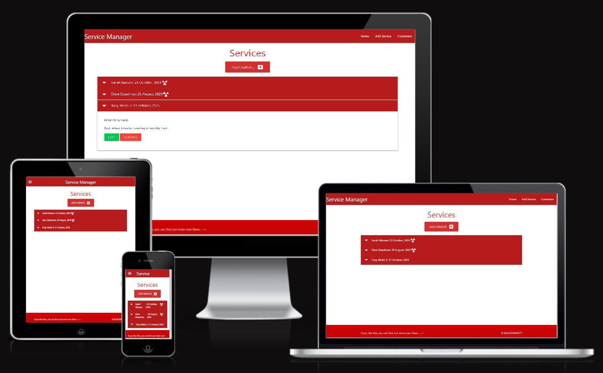
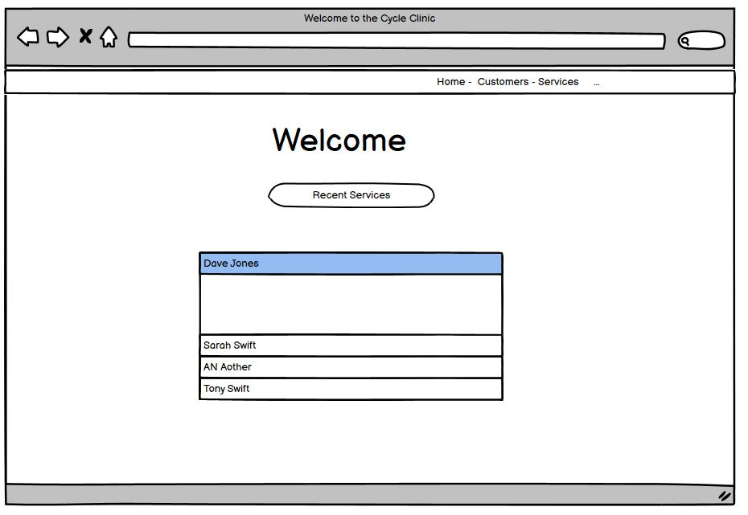
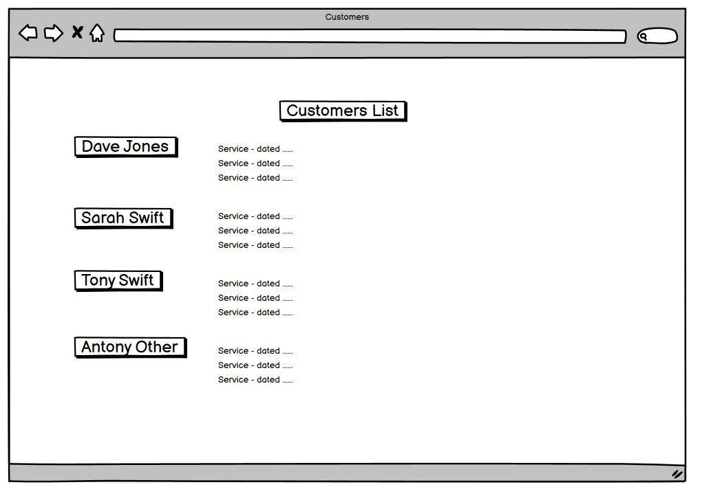
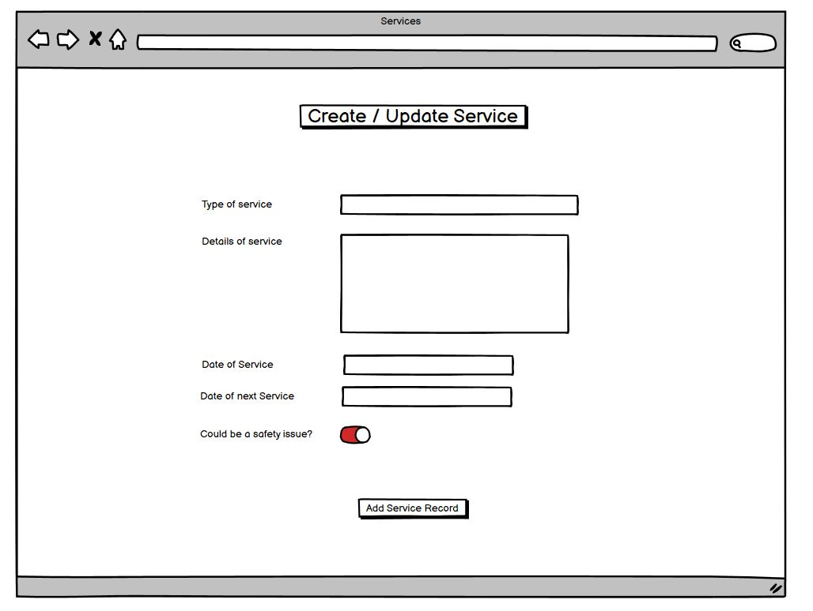
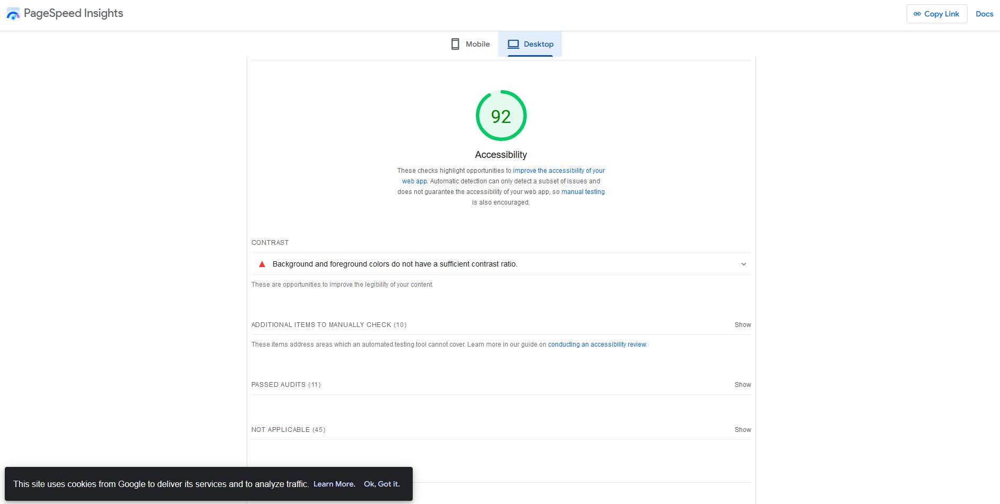
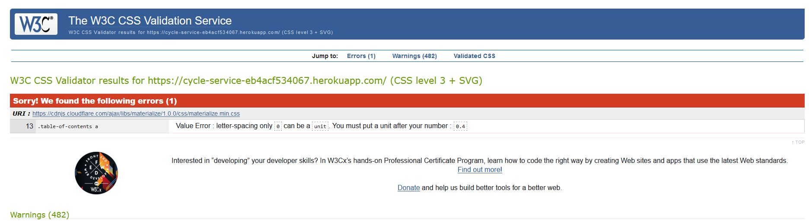
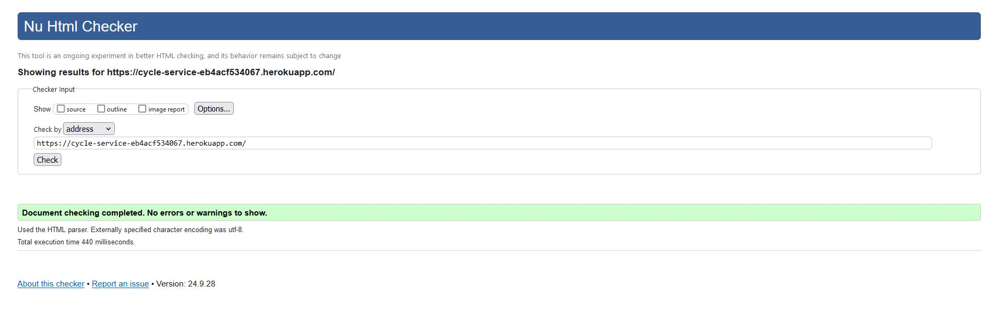
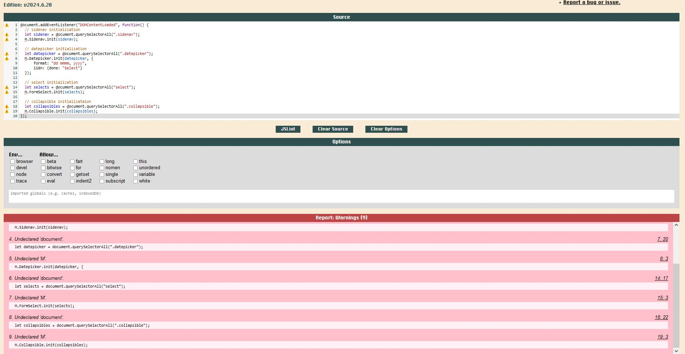

<div align="center">
  
</div>

<div align="left">
  <h1>Welcome to the Service Reminder Readme</h1>
</div>

<div align="left">
  <a target="_blank" href="https://cycle-service-eb4acf534067.herokuapp.com/">Cycle Service Manger</a> is a simple databse app, to store cycle service details and remind the mechanic of the next service due.</div>

## Table of Contents
1. <details open>
    <summary><a href="#user-experience">User Experience</a></summary>

    <ul>
    <li>
    <details>
    <summary><a href="#goals">Goals</a></summary>

    - [Visitor Goals](#visitor-goals)
    - [Business Goals](#business-goals)
    - [User Stories](#user-stories)
    </details></li>

    <li><details>
    <summary><a href="#visual-design">Visual Design</a></summary>

    - [Wireframes](#wireframes)
    - [Fonts](#fonts)
    - [Icons](#icons)
    - [Colors](#colors)
      </details></li>
    </ul>

2. <details open>
    <summary><a href="#features">Features</a></summary>

    <ul>
    <li>
    <details>
    <summary><a href="#page-elements">Page Elements</a></summary>

    - [All Pages](#all-pages)
    - [Index Page](#index-page)
   </details></li>
    

    <li><details open>
    <summary><a href="#technologies-used">Technologies Used</a></summary>
        
    - [Languages](#languages)
    - [Frameworks](#frameworks)
    - [Platforms](#platforms)
    - [Other Tools](#other-tools)
  </details></li>
  </ul>

3. <details open>
    <summary><a href="#testing">Testing</a></summary>

    <ul>
    <li><details>
    <summary><a href="#methods">Methods</a></summary>

    - [Validation](#validation)
    - [General Testing](#general-testing)
    - [Mobile Testing](#mobile-testing)
    - [Desktop Testing](#desktop-testing)
    </details></li>

    <li><details>
    <summary><a href="#bugs">Bugs</a></summary>

    - [Known Bugs](#known-bugs)
    </details></li>
    </ul>
</details>

4. <details open>
    <summary><a href="#deployment">Deployment</a></summary>

    <ul>
    <li><details>
    <summary><a href="#local-deployment">Local Deployment</a></summary>

    - [Local Preparation](#local-preparation)
    - [Local Instructions](#local-instructions)
    </details></li>

    <li>
    <details>
    <summary><a href="#github-deployment">Github Deployment</a></summary>

    - [Github Instructions](#github-instructions)
    </details></li>
    </ul>
</details>

5. <details open>
    <summary><a href="#credits-and-contact">Credits and Contact</a></summary>

    <ul>
    <li><details>
    <summary><a href="#credit-and-contact">Credit and Contact</a></summary>

    - [Content](#content)
    - [Contact](#contact)
    </details></li>
    </ul>
</details>

----

# User Experience
## Goals
### Visitor Goals
Initially the site will be used by a bicycle mechanic who wants to save customer service history, at the same time as setting a reminder to book in a future service. The mechanic will want to be able to: 
- Find work carried out in the past
- See when the next service is due.

### Business Goals
The Business Goals for the site will be:
-  to provide a reliable service history for customers as well as aiding in scheduling services for the mechanic.
    The customer will hopefully feel reassured knowing that the work being carried out is well documented. As a result trending issues can be spotted and dealt with accordingly.
- to enable the mechanic to be able to better maintain repeat custom.
- to build a better relationship with the customer and help to better ensure their safety. Safety in the sense that a well maintained bicycle will be safer on the roads.


### User Stories
- The mechanic would like to know when a part was fitted to know if it was still under warranty.
- The mechanic would like to be able to check to see if a bike was stolen and report it to the police.
- The mechanic wants to be able to update the ownership details of a bicycle.

## Visual Design

### Wireframes

Straightforwar layout, with information loading on default.
<div align="center">
  
</div>

Easy and quick to use input from.

<div align="center">
  
</div>

Option to add detailed information for the service as well as a warning for the next service should something prove to be a possible safety issue to look out for on the next service.

<div align="center">
  
</div>


### Fonts
I used the basic fonts supplied with Google's Materialize.
These are easy to read, and given that the content is almost entirely text, I felt that was a priority.

### Icons
I used fontawesome's icons to make the buttons and and text more intuative and attractive.

### Colors
I went with red and white like the classic doctors symbology. My initial plan was to build a clinic for bicycle type page, but time constraints meant it wasn't possible.

<div align="center">
  
</div>

----

# Features
No main faeature as such, just an exercise in CRUD deployment. I originally planned to have a login page to make it more practical and less prone to abuse.

I also wanted to be able to have images uploaded for the bicycles in a separate cycles table.

## Page Elements
Essentially the index page is a redirect to the service page, whic by default lists the previous srvices in order of most recent due.

The idea being that the mechanic can get in touch wth customers and remind them to book in for future services.
### All Pages
#### Navbar

Really simple layout - Name of the site with quick links.
<div align="center">
  
</div>

#### Footer

Due to time constraints I was forced o keep everything minimalist.

<div align="center">
  
</div>

### Index Page

As started earlier, this is just a redirect to the page that defaults to a list of previous services.

<div align="center">
  
</div>

### Customer Page

Simple layout with customers easily found by the use of big obvious buttons.

Eventually I'd like to be able to see all services listed next to a customer.

<div align="center">
  
</div>

### Service Update Page

As started earlier, this is just a redirect to the page that defaults to a list of previous services.

<div align="center">
  
</div>


----

# Technologies Used

## Languages
- HTML
    * For page markup and layout.
- Javascript
    * For interactivity and programatic reponses.
- Css
    * For ease of styling multiple pages.
- Python
    * Python was used to create the database in PostGres, and to run the app via Heroku

## Frameworks
- [Google's Materialize](https://materializecss.com/)
    * Framework for CSS and Javascript
- [Heroku](https://www.heroku.com)
    * Used to host the python program I created. Heroku renders the html based on the python program.

## Platforms
- [Github](https://github.com/)
    * Storing code remotely and deployment.
- [Gitpod](https://gitpod.io/)
    * IDE for project development.

## Other Tools
- [Krita](https://krita.org/en/)
    * I used Krita to create the bicycle images and crop images for this readme - its an open source tool similar to Adobe Photoshop
- [Balsamiq](https://balsamiq.com/) 
    * was used to create the wireframes for the site layout.
- Royalty free images obtained from https://www.pexels.com/


# Testing
## Methods
### Validation

<h4> The accessibility only scored 92% due to a contrast issue. Something I can easily fix given a little more time.</h4>
<div align="center">

</div>

<h4> The css validator only had one error due to code from Google's Materialize CSS bundle. I am putting this down to an interpretation error on the validator's part.</h4>
<div align="center">

</div>

<h4> No errors found in the HTML validation.</h4>
<div align="center">

</div>

<h4> The jslint validation showed several warnings only, all steming from Google's Materialize JS Code.</h4>
<div align="center">

</div>

### General Testing

### Mobile Testing

Tested on ios and android devices. All functionaility working as expected.

### Desktop Testing

Tested in Chrome, Edge, Firefox and Opera browsers. All functionaility working as expected.

## Bugs

n/a at present.

### Known Bugs

# Deployment
## Local Deployment
### Local Preparation
**Requirements:**
- An IDE of your choice, such as [Visual Studio Code](https://code.visualstudio.com/)
- A GitHub account to allow you to access the repository [Git](https://github.com//)

### Local Instructions
- 1. Download a copy of the project repository [here](https://github.com/blockhead77/service-reminder) and extract the zip file to your base folder. Or you can clone the repository with:
    ```
    git clone https://github.com/blockhead77/service-reminder/
    ```
    To disconnect it from the master repository, use:
    ```
    git remote rm origin
    ```
- 2. Open your IDE and choose the base directory.

- 3. Run the project with your chosen method. You can drop index.html into a web browser and it should run fine, open a local port and access it or, if you have python installed, run it on an HTTP server with python with the terminal command:
    ```
    python3 -m http.server
    ```
- 4. Enjoy!

## Github Deployment
### Github Instructions
1. Log in to your GitHub account.
navigate to [https://github.com/blockhead77/](https://github.com/blockhead77/).
1. You can set up your own repository and copy or clone it, or you can fork the repository.
2. `git add`, `git commit` and `git push` to a GitHub repository, if necessary.
3. GitHub pages will update from the master branch by default.
4. Go to the **Settings** page of the repository.
5. Scroll down to the **Github Pages** section.
7. Select the Master Branch as the source and **Confirm** the selection.
8. Wait a minute or two and it should be live for viewing.

## Credits and Contact
### Content

### Contact
- Please feel free to contact me at `stuartkellock@gmail.com`
